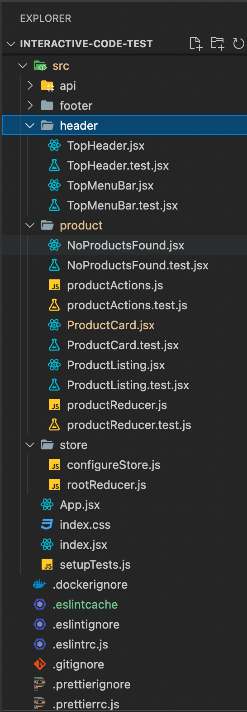

# Getting Started

This project was bootstrapped with [Create React App](https://github.com/facebook/create-react-app).

App Demo: [interactivecode.ml](https://interactivecode.ml)

## Available Scripts

In the project directory, you can run:

### Installing

`yarn` - Install all the dependencies for the web app

### Running Locally

### `yarn start` ~~or `yarn docker-start`~~

You Run the app in the development mode locally.\
by using yarn start
, Open [http://localhost:3000](http://localhost:3000) to view it in the browser.

~~if using yarn docker start
, Open [http://localhost:8443](http://localhost:8443) to view it in browser.~~

The page will reload if you make edits.\
You will also see any lint errors in the console.

~~Using the Docker option you can perfrom your development using the docker contianer.~~

### ~~`yarn docker-stop`~~

~~If you use docker-star then please remember to call docker-stop to bring down the container.
Failure to do so will result in unable to launch again and must stop/kill the continer instance using docker commands.~~

### Unit tests

### `yarn test:watch`

Launches the test runner in the interactive watch mode.\
See the section about [running tests](https://facebook.github.io/create-react-app/docs/running-tests) for more information.

### `yarn test:coverage`

Provides a code coverage report. Look for detailed code coverage report under /coverage folder.

### Build & Maintainance

### `yarn build`

Builds the app for production to the `build` folder.\
It correctly bundles React in production mode and optimizes the build for the best performance.

The build is minified and the filenames include the hashes.\
Your app is ready to be deployed!

See the section about [deployment](https://facebook.github.io/create-react-app/docs/deployment) for more information.

### `yarn eject`

**Note: this is a one-way operation. Once you `eject`, you can’t go back!**

If you aren’t satisfied with the build tool and configuration choices, you can `eject` at any time. This command will remove the single build dependency from your project.

Instead, it will copy all the configuration files and the transitive dependencies (webpack, Babel, ESLint, etc) right into your project so you have full control over them. All of the commands except `eject` will still work, but they will point to the copied scripts so you can tweak them. At this point you’re on your own.

You don’t have to ever use `eject`. The curated feature set is suitable for small and middle deployments, and you shouldn’t feel obligated to use this feature. However we understand that this tool wouldn’t be useful if you couldn’t customize it when you are ready for it.

### `yarn lint`

You can lint your code using the lint option. additionally you can use the `yarn lint:fix` to automatically fix possible lint errors.

### `yarn format`

This proejct uses prettier format to format and beautify the code.

## Project Structure

`Redux` is used for state management `store` folder has the code for adding the store to the app,

`product` folder has all code related to product listing, product card, no results found and the product reducer and product actions.

`header` folder have the search and filter dropdown

`api` folder has all the static product data

`indes.jsx` loads `app` component

### File Naming Convention

- All JSX files to end with extenion `jsx`
- Pure js functions with no react dependency use `js ` extension
- File name to begin with Captalised Letter if the file exports a default module
- folder name to be use camecase notation

## Outstanding Issues

- i18n - add language support for internationalisation
- a11y - valdiate all component have valid aria label, add jst test util `jest-axe`
- docker - fix the docker image to laod react and its depedencies
- npm audit - no attempt has been made to fix the npm audit errors
- test coverage - current threshold is set to `85%` but 95% is be desired
